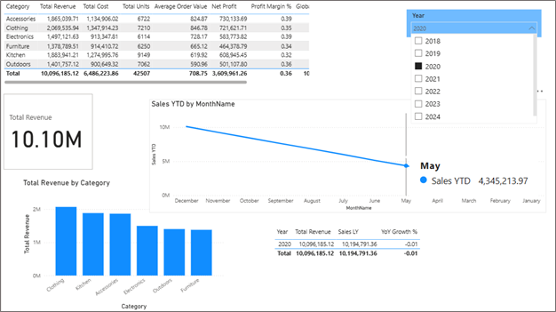

  

  
<em>Figure 1: DSA3050 E-Commerce Sales Performance Dashboard</em>

# Business Intelligence & DAX Lab: E-Commerce Analytics
**Course:** DSA 3050A: Business Intelligence  
**Student:** Hermela Seltanu Gizaw (ID: 670446)  
**Instructor:** Prof. Austin Owuor Odera  
**Institution:** United States International University - Africa (USIU-A)

---

## 📊 Project Overview
This repository contains a comprehensive Power BI project focused on advanced DAX implementation and Star Schema modeling. The project utilizes a synthetic e-commerce dataset to simulate real-world business intelligence scenarios, including regional performance analysis and year-over-year growth tracking.

## 🛠️ Data Model Architecture
The project is built on a **Star Schema** to ensure optimal performance and filter propagation:
- **Fact Table:** `FactSales` (Centralized transactions)
- **Dimension Tables:** `DimProduct`, `DimGeography`, `DimDate`, `DimCustomer`, `DimEmployee`

## 🧪 Advanced DAX Implementation

### 1. Context Override (Section D)
Used `CALCULATE` with `ALL()` to bypass filter context for global benchmarking.
- **Key Measure:** `% Contribution` = `DIVIDE([Total Revenue], [Global Revenue])`

### 2. Iterator Functions (Section E)
Used `SUMX` and `AVERAGEX` to maintain row-level granularity for calculations not present in the raw data (e.g., Row-level Tax and Average Profit).

### 3. Time Intelligence (Section F)
Implemented specialized time functions to enable trend analysis:
- `TOTALYTD`: For cumulative annual growth.
- `SAMEPERIODLASTYEAR`: For comparative performance analysis.

## 🚀 Visualizations
The final dashboard includes:
- **Executive Summary Cards:** Real-time revenue tracking.
- **YTD Trend Analysis:** Line charts demonstrating cumulative sales logic.
- **Segment Breakdown:** Bar charts for product tier performance.
- **Validation Tables:** Direct comparison of filtered vs. unfiltered data.

## 📁 Repository Structure
- `DAX.pbix`: The primary Power BI file.
- `Documentation.pdf`: Full technical report explaining the logic and methodology.

---
*Developed as part of the Spring 2026 Semester coursework.*
